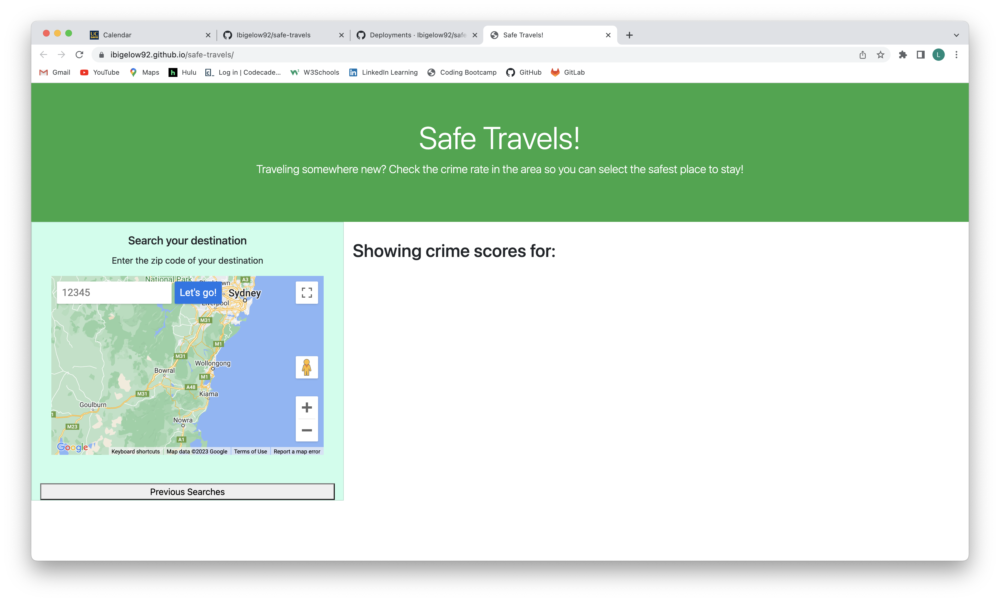
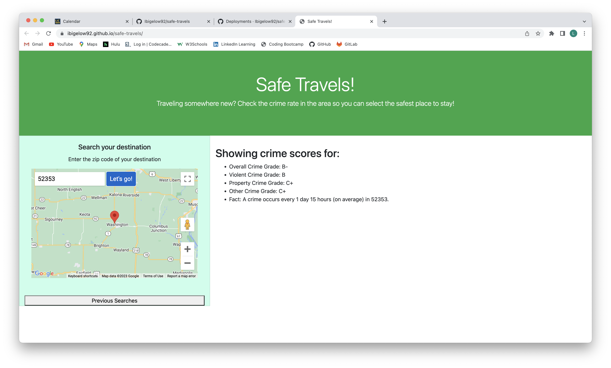
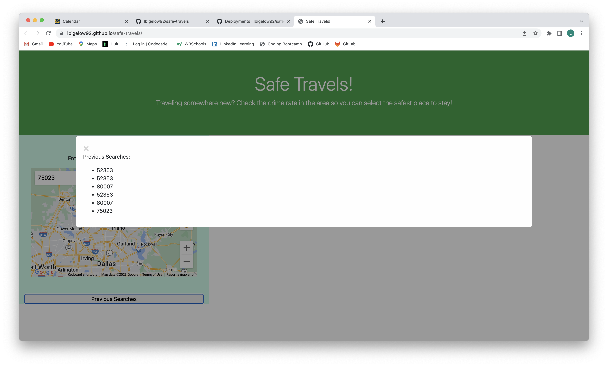

# Safe Travels!

## Description

This application allows a user to search for crime scores using a ZIP code submission.  It is a simple, easy to understand application that quickly supplies letter-grade crime scores to the user.  This would be helpful when the user is relocating, looking for a safe vacation area, or choosing a hotel for business travel purposes.

The project gave us the opportunity to practice skills using HTML, CSS, Javascript, Bootstrap, and two server-side APIs.  In addition, we gained experience collaborating, and merging individual branches into the Github repository.

We learned a lot about researching APIs, and then implementing them to return data for our application.  We overcame challenges with getting them coded to function in tandem, using the submit button to operate both APIs, as well as sorting the data to display the pieces we wanted into our browser window.  We also worked to make the CSS more responsive at smaller screen sizes.

Some potential future updates to the application include:  Safe Travels! would like to add local news information, as well as contact information for local police agencies and other local resources to aid a traveler's overall safety and wellbeing.

## User Story

As a traveler
I WANT to view safety reports for multiple cities
SO THAT I can plan a trip accordingly.

## Acceptance Criteria

GIVEN that I am using an application to report safety information about an area,
WHEN I open the application
THEN I can easily see where to input the Zip code,
WHEN I click the "Geocode" button
THEN the crime score report appears on the screen,
WHEN I click the "Clear" button
THEN the selected Zip code is cleared from the input box,
WHEN I refresh the page
THEN the previous searches are saved,
WHEN I use the "Previous Searches" drop down menu,
THEN I can select and view the data from the previous searches.

## Installation

Safe Travels! is a web application, deployed at https://ibigelow92.github.io/safe-travels/.

## Usage

To find the crime score data for an area, simply enter the Zip code for the area, and click on the "Let's go!" button.  The application displays a map of the area submitted, and returns crime score information to the right of the map.

### Screenshots:

In addition, the application allows the user to review previously searched Zip codes (stored in local storage).

## Credits

This application was built as a collaboration between:
Ira Bigelow https://github.com/Ibigelow92,
Danae Lyons https://github.com/Danaelyons, 
Jaskaran Kaur https://github.com/jaskaur91, 
Frederick Dirige https://github.com/fdirige, 
and Laura Hardy-Wilcox https://github.com/lhardywilcox.

The maps used in the application are courtesy of the Google Geocode API, and the crime score information is courtesy of the Crime Score by Zip Code API.  The respective documentation for the APIs was referenced extensively during the creation of the API.

We were also assisted by our Instructor, Teaching Assistants, and Tutors during our project.  They answered A LOT of questions!

## License

MIT License

